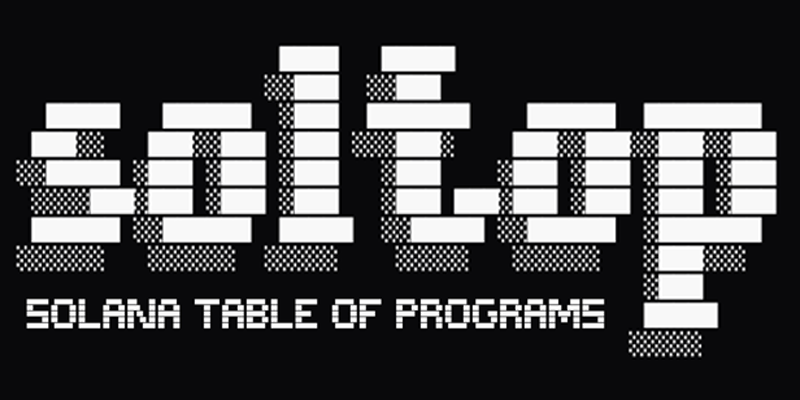
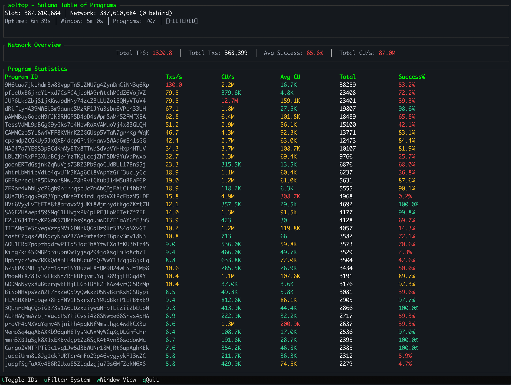

<p align="center">
  
</p>

<h1 align="center">soltop</h1>

<p align="center">Terminal UI for monitoring Solana program performance in real-time — like <code>htop</code> for Solana programs.</p>


## Overview

`soltop` provides real-time monitoring of Solana program activity through an interactive terminal interface. Track transactions per second, compute unit consumption, success rates, and more across all active programs on the network.

### Features

- **Real-time Program Monitoring**: Live tracking of all programs executing on Solana
- **Performance Metrics**: TPS, compute units, success rates, transaction counts
- **Network Overview**: Slot tracking, lag monitoring, aggregate statistics
- **Interactive UI**:
  - Sort by any column (TPS, CU/sec, success rate)
  - Toggle between live and windowed statistics
  - Hide/show system programs (Vote, System, Token programs)
  - Truncate or show full program IDs
- **Customizable**: Choose RPC endpoint, configure monitoring preferences
- **Lightweight**: Low resource usage, runs smoothly in any terminal

### Preview



## Installation

### From GitHub Releases (Recommended)

Download the latest binary for Linux x86_64:

```bash
# Download the latest release
wget https://github.com/jacquesmats/soltop-oss/releases/latest/download/soltop-linux-x86_64

# Make it executable
chmod +x soltop-linux-x86_64

# Move to PATH (optional)
sudo mv soltop-linux-x86_64 /usr/local/bin/soltop
```

### From Source

Requires Rust 1.75 or later:

```bash
git clone https://github.com/jacquesmats/soltop-oss.git
cd soltop-oss
cargo build --release
./target/release/soltop
```

## Usage

### Basic Usage

```bash
# Monitor Solana mainnet with default settings
soltop

# Use a custom RPC endpoint
soltop --rpc-url https://your-rpc-endpoint.com

# Hide system programs by default
soltop --hide-system

# Enable verbose performance statistics
soltop --verbose
```

### Command-Line Options

```
Options:
  -v, --verbose            Enable verbose performance statistics
      --rpc-url <URL>      RPC endpoint URL
                           [default: https://api.mainnet-beta.solana.com]
      --hide-system        Hide system programs (Vote, ComputeBudget, System)
  -h, --help               Print help information
```

### Keyboard Controls

| Key | Action                                           |
| --- | ------------------------------------------------ |
| `q` | Quit the application                             |
| `t` | Toggle program ID truncation (full vs shortened) |
| `u` | Toggle system program visibility                 |
| `w` | Toggle view mode (Live vs Window aggregate)      |

### View Modes

- **Live Mode** (default): Shows recent activity with real-time updates
- **Window Mode**: Aggregated statistics over the entire monitoring window (5 minutes)

## Understanding the Display

### Network Overview Panel

```
┌ Network Overview ────────────────────────────────────────────┐
│ Slot: 285742301 | Network: 285742305 | Lag: 4 slots         │
│ Uptime: 2m 15s | Window: 5m 0s | Programs: 42              │
│ Total TPS: 3,247.5 | Total Txs: 125,843 | Avg Success: 94.2%│
│ Total CU/sec: 48,000,000,000                                │
└──────────────────────────────────────────────────────────────┘
```

- **Slot**: Current slot being processed by soltop
- **Network**: Latest slot on the Solana network
- **Lag**: How many slots behind the network tip soltop is
- **Uptime**: How long soltop has been running
- **Window**: Time window for statistics aggregation (5 minutes)
- **Programs**: Number of active programs detected
- **Total TPS**: Aggregate transactions per second across all programs
- **Total Txs**: Total transaction count in the current window
- **Avg Success**: Average success rate across all programs
- **Total CU/sec**: Aggregate compute units consumed per second

### Program Statistics Table

```
┌ Programs ────────────────────────────────────────────────────┐
│ Program ID              TPS    Txs   Success  CU/sec    AvgCU│
├──────────────────────────────────────────────────────────────┤
│ JUP6Lkb...aV4         847.2  52.4k   98.5%    12.8B    15,123│
│ 675kPX9...SQv         423.1  18.2k   95.2%     8.4B    19,847│
└──────────────────────────────────────────────────────────────┘
```

- **Program ID**: Solana program public key (truncated by default, press `t` to toggle)
- **TPS**: Transactions per second for this program
- **Txs**: Total transaction count in the window
- **Success**: Success rate percentage
- **CU/sec**: Compute units consumed per second
- **AvgCU**: Average compute units per transaction

## Architecture

```
soltop/
├── src/
│   ├── main.rs          # Entry point, CLI argument parsing
│   ├── lib.rs           # Public API exports
│   ├── rpc/             # Solana RPC client and data fetching
│   │   ├── client.rs    # RPC HTTP client (JSON-RPC)
│   │   ├── parser.rs    # Log parsing for compute units
│   │   └── types.rs     # RPC response types
│   ├── stats/           # Statistics collection and aggregation
│   │   ├── monitor.rs   # Main monitoring coordinator (producer/consumer)
│   │   ├── network.rs   # Network-wide state management
│   │   ├── program.rs   # Per-program statistics
│   │   ├── ring_buffer.rs # Efficient circular buffer
│   │   └── filter.rs    # System program filtering
│   └── ui/              # Terminal user interface
│       ├── app.rs       # Main TUI application logic
│       └── theme.rs     # Color schemes
└── Cargo.toml
```

### How It Works

1. **Data Collection**: Polls Solana RPC endpoint every 400ms for new slots
2. **Parsing**: Extracts program invocations and compute unit usage from transaction logs
3. **Aggregation**: Maintains rolling window of statistics using ring buffers (5-minute window)
4. **Rendering**: Updates TUI at ~10fps with cached statistics

The application uses a **producer-consumer** pattern:

- **Producer task**: Continuously fetches new slots from the RPC endpoint
- **Consumer task**: Processes slot data and updates program statistics
- **UI task**: Renders the terminal interface with cached stats

## Performance Considerations

- **RPC Load**: Each soltop instance makes approximately 2-3 RPC requests per second
- **Memory Usage**: ~10-50MB depending on number of active programs
- **CPU Usage**: <5% on modern systems
- **Network Bandwidth**: ~100KB/sec

**Recommendation**: Use a dedicated RPC endpoint or rate-limited public endpoint for production monitoring. Public RPC endpoints may throttle requests.

## Known Limitations

- **Platform Support**: Currently Linux x86_64 only (macOS and Windows support planned)
- **Distribution**: Binary releases only (crates.io publication planned for future release)
- **Navigation**: Keyboard navigation in program list (up/down arrows) not yet implemented
- **Compute Units**: Some programs may not emit detailed logs, resulting in incomplete CU metrics

## Troubleshooting

### Connection Issues

If soltop fails to connect to the RPC endpoint:

```bash
# Test RPC endpoint accessibility
curl -X POST -H "Content-Type: application/json" \
  -d '{"jsonrpc":"2.0","id":1,"method":"getSlot"}' \
  https://api.mainnet-beta.solana.com
```

If the endpoint is unreachable, try a different RPC provider or check your network connection.

### High CPU Usage

- Ensure you're using a responsive RPC endpoint with low latency
- Public endpoints may have rate limits causing retries and increased CPU usage

### Program Not Appearing

- Some programs may not be active in the current monitoring window
- System programs are hidden by default (press `u` to show them)
- Very low-activity programs may not accumulate enough transactions to appear in rankings

### Terminal Display Issues

- Ensure your terminal supports UTF-8 and has a minimum width of 80 characters
- If colors appear incorrect, try a different terminal emulator

## Contributing

Contributions are welcome! Please see [CONTRIBUTING.md](CONTRIBUTING.md) for guidelines on:

- Setting up a development environment
- Code style and formatting
- Running tests
- Submitting pull requests

## License

This project is licensed under the MIT License - see the [LICENSE](LICENSE) file for details.

## Acknowledgments

- Built with [ratatui](https://github.com/ratatui-org/ratatui) for the terminal UI
- Powered by [tokio](https://tokio.rs/) for async runtime
- Inspired by `htop` and the need for better Solana program monitoring
- Thanks to the Rust and Solana communities for their support

## Roadmap

Future plans for soltop:

- [ ] **Multi-platform support**: macOS (arm64 + Intel) and Windows binaries
- [ ] **crates.io publication**: `cargo install soltop` support
- [ ] **Configurable monitoring window**: User-defined time windows beyond 5 minutes
- [ ] **Historical data export**: Export statistics to CSV, JSON for analysis
- [ ] **Alert thresholds**: Notifications when programs exceed thresholds
- [ ] **Keyboard navigation**: Scroll through program list with arrow keys
- [ ] **Multiple themes**: Dark, light, and custom color schemes
- [ ] **RPC connection pooling**: Better performance with multiple endpoints
- [ ] **Integration tests**: Comprehensive testing with mock RPC
- [ ] **Configuration file**: Save preferences in ~/.config/soltop/config.toml

## Community

- **Issues**: Report bugs or request features on [GitHub Issues](https://github.com/jacquesmats/soltop-oss/issues)
- **Discussions**: Ask questions or share ideas in [GitHub Discussions](https://github.com/jacquesmats/soltop-oss/discussions)

---

**Built with 🦀 for the Solana ecosystem**
